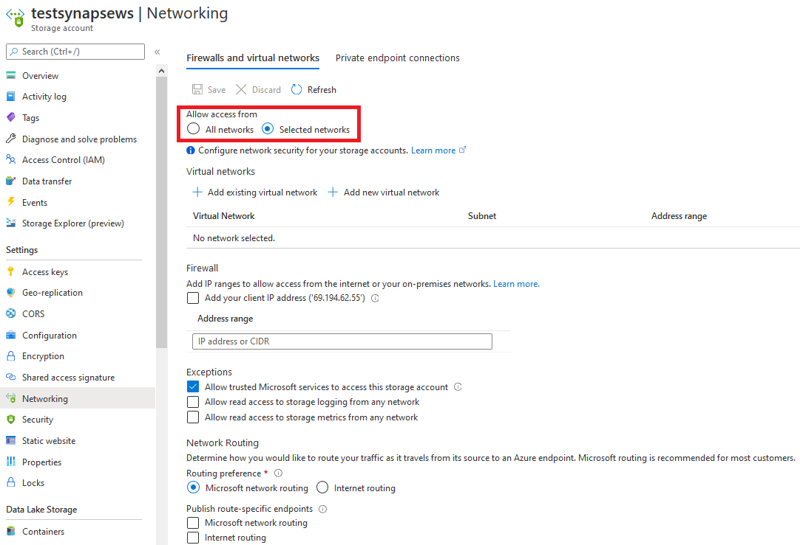

# Synapse Analytics Workspace access Storage Account with Firewall

## Problem

1. Synapse Analytics Workspace create it's own PaaS managed resources, such as dedicated SQL pool (Dataware House) and Spark cluster.
2. When create Synapse workspace, you have option to create a Managed Network with it, however you have no visibility / direct control of this Managed Network.
3. Azure Storage Account is created in the same region as Synapse Workspace, when firewall turned on the storage account, Spark cluster will be blocked by the firewall.
4. Synapse Workspace Studio and SQL clusters however are able to access the storage account via [Trusted Microsoft Services](https://docs.microsoft.com/en-us/azure/storage/common/storage-network-security#trusted-microsoft-services)

## Solution

I have issue opened with Microsoft [here](https://github.com/MicrosoftDocs/azure-docs/issues/67831#issuecomment-747866989)

Microsoft suggested when Synapse Workspace gets created with Managed Network, it's possible to get into Synapse Workspace console, create a Managed Private Endpoint with the storage account. Once the private endpoint got approved on storage account, spark cluster would work.

## Testing

1. Create Synapse Workspace, choose to create storage account with it and assign role
    

2. Configure security
    

3. Configure networking
   

4. Click **Review + create** button to create the Synapse Workspace

5. Go to Storage Account, make sure firewall is turned on
    

6. Follow [Quick Start](https://docs.microsoft.com/en-us/azure/synapse-analytics/get-started-create-workspace#create-a-dedicated-sql-pool) create dedicated SQL pool and Spark Pool

7. Follow [Analyze data with dedicated SQL pools](https://docs.microsoft.com/en-us/azure/synapse-analytics/get-started-analyze-sql-pool), it should work

8. Follow [Analyze with Apache Spark](https://docs.microsoft.com/en-us/azure/synapse-analytics/get-started-analyze-spark)
   - Following code would work

   ```SPARK

    from azureml.opendatasets import NycTlcYellow
    data = NycTlcYellow()
    data_df = data.to_spark_dataframe()
    # Display 10 rows
    display(data_df.limit(10))

    ```

    

    - Following code would fail, note it gets 403 accessing the data lake storage

    ```SPARK
    %%spark
    spark.sql("CREATE DATABASE IF NOT EXISTS nyctaxi")
    val df = spark.read.sqlanalytics("SQLPOOL1.dbo.Trip") 
    df.write.mode("overwrite").saveAsTable("nyctaxi.trip")
    ```

    

9. Follow [Microsoft suggestion](https://docs.microsoft.com/en-us/azure/synapse-analytics/security/synapse-workspace-managed-private-endpoints)
    - Within Synapse Workspace Studio, choose Manage, under Security, Managed private endpoints, + New
    
    - Choose Data Lake Storage Gen2 and pick the storage account, note it indicates you need to approve this request on storage account
    

10. The new endpoint will first show as provisioning, then change to pending
    

11. Go to storage account, networking, select Private endpoint connections tab, select the request, and click on Approve button
    

12. After couple of minutes, within Synapse Studio, the new endpoint will show as approved
    

13. Rerun Spark notebook and this time getting this error:

    ```SPARK
    %%spark
    spark.sql("CREATE DATABASE IF NOT EXISTS nyctaxi")
    val df = spark.read.sqlanalytics("SQLPOOL1.dbo.Trip") 
    df.write.mode("overwrite").saveAsTable("nyctaxi.trip")
    ```

    ```err
    Error : com.microsoft.spark.sqlanalytics.exception.SQLAnalyticsConnectorException: com.microsoft.sqlserver.jdbc.SQLServerException: CREATE EXTERNAL TABLE AS SELECT statement failed as the path name 'abfss://users@testsynapsews.dfs.core.windows.net/synapse/workspaces/test-synapse-ws/sparkpools/Spark1/sparkpoolinstances/b8a2a560-82f2-4e88-8cae-8e715a2a9a5e/livysessions/2021/01/15/0/tempdata/SQLAnalyticsConnectorStaging/application_1610724646380_0001/ae61C6NuJNAcbbda6d98d854195995c206dd7371314.tbl' could not be used for export. Please ensure that the specified path is a directory which exists or can be created, and that files can be created in that directory.
    ```

    

14. Removed private endpoint and disabled Storage account firewall. rerun Spark notebook, and it works fine:

    ```SPARK
    %%spark
    spark.sql("CREATE DATABASE IF NOT EXISTS nyctaxi")
    val df = spark.read.sqlanalytics("SQLPOOL1.dbo.Trip") 
    df.write.mode("overwrite").saveAsTable("nyctaxi.trip")
    ```

    
